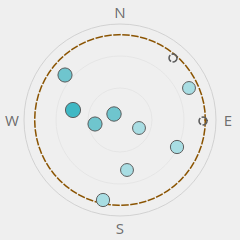
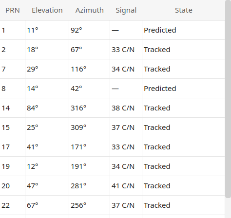

# How to use

This is for the person with the application installed and a receiver on a serial port. It says
what each window shows, what every control does, which key does what, and what happens when you
close it. It does not explain the receiver itself — the manuals do that — and it does not explain
how to build or change the application; the README and the specification do.

Every picture here was rendered from this application in the **Light** theme, driven from the
captured status screens in `tests/fixtures/`, so the numbers are real ones from a real Z3805A. The
details pages were captured in a window 1120 px wide; narrower, and the Satellites page's two
cards stack into one column.
`tools/capture_guide_images.py` produces them, and is the only thing that does.

> **If you know the Windows application**, [`divergences.md`](divergences.md) is the page to read
> first: what is different here, what is a reduction, and what is deliberately identical. This
> guide describes only what this port does.

---

## The main window

The main window is meant to be left open — on a second monitor, in a corner, for weeks. Everything
on it answers one of two questions: *what state is the receiver in*, and *how well is it doing*.

Three buttons sit above it. **Connect…** opens the connection dialog, **Details…** opens the
Receiver Details window, and the picker at the right chooses **Light** or **Dark**. A fourth,
**Retry now**, appears only while a connection is being supervised, and asks for the next
reconnection attempt rather than waiting out the growing pause.

### The medallion

The circle is the one thing to look at. Its **colour**, the **shape of its tick marks** and the
**words beside it** all say the same thing, so you never have to read the colour alone.

**Its centre is the satellite count**, not a symbol. That is the number which changes and the one
that answers *is it working right now*, and it stays in the centre at every size — including the
compact layout, where it is the only number left. A count the receiver did not report shows as
**—**.

| Words beside it | Colour | What it means |
|---|---|---|
| **Locked to GPS** | green | Disciplining the oscillator to GPS. The normal state. |
| **Recovering** | amber | Coming back from holdover; not yet locked. The Holdover page says what it is waiting for. |
| **Holdover** | red | Lost GPS and running on the oscillator alone. Time error grows the longer this lasts. |
| **Powering up** | grey | Just switched on; nothing to report yet. |
| **Unknown** | grey | No mode line in the receiver's status screen carried the marker that names the active mode. |

Two more lines sit under the mode:

- **Outputs** — the single most important thing this window has to say, because it has four states
  and the middle one matters: *Outputs valid* (green), **Outputs valid, reduced accuracy** (amber —
  usable but drifting), *Outputs not valid* (red — do not use), and *Outputs unknown* (grey, which
  means nothing was read, not that something was read and found wanting).
- **Health** — *Health OK* while every subsystem the receiver checks passes, and otherwise the
  names of the ones that do not.

Below them, where the receiver gives one, is its own words for what it is doing — `GPS 1PPS
invalid` and the like — set in the monospaced face every string the receiver emits is set in, so
you can tell what it said from what this application says about it.

### The readouts

- **Time figure of merit (TFOM)** is the receiver's own estimate of its time error, on a scale
  where lower is better — TFOM 3 means the error is between 100 ns and 1 µs.
- **Frequency figure of merit (FFOM)** is the state of the frequency loop; FFOM 0 means the PLL has
  stabilised. The Timing page spells both out in words next to the number.
- **1 PPS interval** is the time between the receiver's pulse and GPS, in nanoseconds. A few tens
  of nanoseconds either side of zero is normal for a locked Z3805A.
- **Oscillator EFC** is the control voltage the receiver is applying to steer its oscillator, as a
  percentage of its range.

A value the receiver has not reported, or reported in a form the application could not read, is
shown as **—**. It is never a zero: *not reported* and *reported as nought* are different claims,
and on a timing instrument the difference is the whole point.

### The status line

The line at the foot names what the application is doing — `Connected to Z3805A — /dev/ttyUSB0 @
9600-8-N-1` once it is up, and before that the port it is trying, the settings it is trying them
at, and the reason if it failed. `Demo — replaying captured status screens` means the application
was started with `--demo` and there is no receiver.

### Compact mode

Compact mode is for a corner of the screen: the medallion shrinks to 64 px, the satellite count
stays in its centre, and everything else — the readouts, the health line, the button row, the
status line — is **removed from the layout** rather than hidden behind an edge, so nothing stays
focusable off-screen. The window shrinks with it and returns to its previous size when you leave.

Enter and leave it with **`Ctrl+Shift+M`**; **`Esc`** also leaves it. Both are bound to the window
rather than to any button, which is what makes them work in a layout that has no buttons left.

> §9.6.2 also gives a double-click on the medallion as a way in and out. That is **not built
> here** — the two keys are the whole of it.

---

## Connecting

Reached from the main window's **Connect…** button or `Ctrl+Shift+C`.

- **Port** lists the serial ports this machine can see, each with the adapter's own description.
  **Refresh** re-scans after plugging one in. On Linux this includes the motherboard's `/dev/ttyS*`
  ports as well as USB adapters; under WSL you will see only the former unless a USB adapter has
  been attached with `usbipd`. If no ports appear at all, the dialog says so rather than offering
  an empty picker and a live Connect button.
- **Auto-detect settings** tries the likely baud rates and framings — listening first for a
  receiver that talks by itself, then asking for an identity — until one is recognised, and reports
  which combination it is on as it goes. Use it unless you know the settings. **Manual** enables
  baud, data bits, parity and stop bits: the Z3805A's factory setting is 9600-8-N-1; a Z3801A
  leaves the factory at 19200-7-O-1, though some units in the field are set to even parity.
- **Reconnect automatically** keeps trying after the link drops — the adapter unplugged, the
  receiver power-cycled — with a growing pause between attempts. **Retry now** on the main window
  skips the pause.
- **Connect to this device on launch** does what it says; with it on, the application connects
  itself every time it starts.

Handshaking is always off. The application asserts DTR and RTS when it opens the port, which some
adapters need.

**Without a receiver**, start it with `smartclock-monitor --demo`: the ten captured status screens
are replayed through the real protocol and the real poll loop, so every page fills as it would on
the bench. `smartclock-monitor --doctor` reports whether this machine has what Qt needs.

### Other receivers

The application also connects to any GPS receiver that speaks **NMEA 0183** — a u-blox module, a
marine receiver — through the same dialog: auto-detect hears it talking and chooses the NMEA driver
by itself. Such a receiver has no disciplined oscillator, so the application shows only what NMEA
carries: the mode (**Locked to GPS** with a fix, **Powering up** without one), the satellites being
tracked and the sky plot, the position, and the time and date. The 1 PPS interval, TFOM and FFOM,
the outputs, holdover, EFC, cable delay, status registers, self test, receiver log and error queue
have nothing behind them and show **—**, and the Advanced Console offers that family's own
commands and no others.

**Anything the receiver cannot do is greyed out with a line saying why** — *"This receiver does not
support an elevation mask. The NMEA 0183 driver has no command for it."* The controls are not
hidden: a page that quietly lost half of itself would look either broken or, worse, complete, and a
button that is visible and silently does nothing is the one thing that must not happen. So the
pages stay as they are, with dashes where a reading would be and a reason where a command would be.

---

## Receiver Details

Open it with **Details…** or `Ctrl+D`. It is one window; opening it again brings the existing one
forward. Closing it leaves the receiver being polled — only the main window's close stops that.

### The command bar

- **Refresh** (`F5`) asks the receiver for the current page's data now rather than waiting for the
  next scheduled read. It is greyed on pages that have nothing to re-read, and while nothing is
  connected.
- **Export** (`Ctrl+E`) writes what the current page is showing as CSV, to a file named for the
  page and the moment the reading was taken — `smartclock-timing-20260827-205220.csv`. It is
  disabled on pages with nothing exportable.
- **Settings** (`Ctrl+,`) goes to the Settings page.
- **Help** (`F1`) opens this guide in its own window. `F1` does the same from the main window.

Each button's tooltip carries its key. There is no status pill here: which port is connected is on
the main window's status line.

### The pages

`Ctrl+1` to `Ctrl+9` jump to the first nine in the order shown — so **Settings is `Ctrl+9`** — and
the Advanced Console has no accelerator, because there is no `Ctrl+10`. The pane is always a list
of words rather than a rail of icons.

Each page's cards stack in one column, except the Satellites page, whose sky plot and table sit
side by side. A page taller than the window scrolls; none of them scrolls sideways.

#### Overview — `Ctrl+1`

- **Synchronization** — the mode, the receiver's own detail line beside it, whether its **outputs
  are valid**, the **time scale** it is keeping, **when** the reading it is showing was captured,
  and any **warnings** the parser raised. A field of the status screen the application could not
  read is reported here rather than guessed at, which makes this the first place to look when a
  reading is dashed and should not be — usually a firmware revision printing something slightly
  different.
- **Health monitor** — one pill per subsystem the receiver checks: self test, internal power, oven
  power, the oscillator, its control voltage, and the GPS receiver. A failing subsystem turns its
  pill red. Running the self-test is on the Diagnostics page, because it is not a thing to do by
  accident.
- **Receiver** — the four fields the receiver answers `*IDN?` with: manufacturer, model, serial
  number and firmware revision, in the monospaced face, verbatim. It is how you know you are
  talking to the instrument you think you are. If the answer was not four comma-separated fields
  the raw answer is shown instead, rather than four dashes — *a model this build has not seen* and
  *nothing is connected* are different statements.

#### Satellites — `Ctrl+2`

- **Sky** is the sky as the antenna sees it, north up, the horizon at the rim and straight up at the
  centre. Each mark is a satellite at its position: **filled** where it is being tracked, **hollow**
  where the receiver only predicts it should be there. The fill's darkness is signal strength and
  nothing else, so two satellites of equal strength look equal. A dashed circle marks the
  **elevation mask**. Arrow keys move between satellites, `Home` and `End` jump to the ends, and
  `Enter` or `Space` selects one.

  

- **Tracked and predicted** is the same information as a table, not a fallback for it: PRN,
  elevation, azimuth, signal strength and state. Signal strength is reported on whichever scale the
  receiver printed — `C/N` runs 26–55 with 35 and above good, `SS` runs 0–255 — and the column says
  which, because the two are wrong by a factor of five if confused.

  

- **Elevation mask** — satellites below this elevation are ignored. The box **opens on the mask the
  receiver is using**, not on a default, so you can see what it is set to before changing it. Type
  a new angle and press **Apply**; it asks first, because a mask set too high can leave the
  receiver with too few satellites. Once you have typed, the number is yours: the once-a-second
  sweep will not overwrite it mid-edit.
- **Save image…** writes the plot to a file, with a caption naming the mask and the time.
- **Manage…** opens a dialog that reads the receiver's inclusion and exclusion lists and offers the
  commands that change them: track only the selected satellites, track all, clear exclusions, track
  none, exclude all. Each is confirmed before it is sent and nothing is staged, so closing the
  dialog sends nothing. Tracking none, or excluding them all, drives the receiver into holdover —
  the dialog says so.

#### Position — `Ctrl+3`

- **Position** — the antenna position the receiver is using for its timing solution, with the
  **datum** it reports it on, the **mode** it is in, and whether a **survey** is running or
  suspended. The coordinates are in the monospaced face because they are the receiver's own text.
- **Survey** — a timing receiver needs to know exactly where its antenna is, and it can work that
  out by averaging fixes for about two hours. **Start survey** begins that; **Adopt computed
  position** stops early and takes the average so far; **Cancel** goes back to the last held
  position; **Survey on power-up** makes the receiver survey every time it is switched on. All of
  these are confirmed before they are sent.
- **Set position by hand** — if you know the antenna position better than a survey would, enter it
  here in degrees, minutes and seconds. Enter it **on the datum the receiver itself reports**,
  shown above: the manual contradicts itself about whether the height is above mean sea level or
  the ellipsoid, the two differ by tens of metres, and nothing here converts between them. Applying
  a position is confirmed and cancels any survey in progress, because a wrong position degrades
  timing.

#### Timing — `Ctrl+4`

- **Antenna cable delay** — the receiver corrects its 1 PPS for the time the signal spends in the
  antenna cable, and it needs to be told how long that is. Either **enter the delay directly** in
  nanoseconds, or **calculate it from the cable**: pick a named cable type and give its length in
  metres. **Apply delay** is confirmed first — changing it while locked can push the receiver into
  holdover, and the note above the button says so.
- **Figures of merit** — TFOM, FFOM, the 1 PPS interval and the EFC, the same four the main window
  carries, with their full names.
- **Clock** and **Holdover** — the receiver's time and its holdover figures, repeated here so that
  everything the timing loop is doing can be read on one page. The Time and Holdover pages are
  where they are explained.
- **1 PPS time interval** — the trend, over **1 h**, **6 h**, **24 h** or **7 d**. One range
  selector serves both charts on this card, because the point of the EFC chart sitting under the
  interval chart is that the two are read together.
  - **Oscillator control (EFC)** — the same range. A slowly drifting EFC is the oscillator ageing;
    a sudden change is worth a look.
  - **Oscillator drift** — how the EFC is trending, which is the oscillator's ageing rate.
  - **Stability (Allan deviation)** — the standard measure of an oscillator's short-term stability,
    computed from the recorded 1 PPS readings for a range of averaging times τ. The **differences
    averaged** column matters: a σy(τ) computed from a handful of differences is a rough number,
    and one from thousands is a firm one.

  All four need recorded history. A fresh install has none and says so rather than drawing an empty
  chart and leaving you to work out why.

#### Holdover — `Ctrl+5`

Holdover is what the receiver does when it loses GPS: it keeps its oscillator running on the
corrections it had learned, and its time error grows from there.

- **Current state** — whether it is in holdover, the **predicted 24 h uncertainty**, the **present
  time error**, how long it has been in holdover, and — while it is *recovering* — the **reason** it
  is still waiting.
- **Thresholds** — there are two here, they measure different things, and **only the second can be
  changed**. The page says so beside each; this is the short version.

  - **Uncertainty threshold** is what the *predicted 24 h uncertainty* above is compared against.
    *Currently exceeded* means that if the receiver lost GPS now and ran on its own oscillator for
    a day, its time error would be expected to pass this figure. It is a **prediction about the
    oscillator, not a fault** — a receiver that has not been locked for long has not yet learned
    enough to promise better — and it is **read only**: the receiver's command set has exactly one
    settable threshold and this is not it.
  - **Holdover duration limit** is that one. It is how long the receiver may stay in holdover
    before it *raises a flag* — and nothing else: it does not end holdover, and it changes no
    output. The receiver simply starts reporting that holdover has run longer than you allowed, in
    the Questionable status register, which is what the state above reads. Enter a new value in
    seconds and **Apply**, after confirmation. The factory value is 86 400 seconds, one day; the
    setting is stored in the receiver and survives a power cycle.

  The two are easy to confuse, and the confusion has a symptom worth naming: change the duration
  limit and the uncertainty reading above it will never move, because they are not the same
  quantity.

- **Manual control** — **Force holdover** puts the receiver into holdover deliberately, for testing
  or before pulling the antenna; **Recover now** asks it to leave holdover; **Ignore recovery
  limit** overrides the check that keeps it waiting. Each is confirmed, and the note above them is
  worth reading once: a receiver that has not been powered up for long has not finished learning
  its oscillator, and forcing holdover then corrupts that learning rather than testing it.

  The **time since power-up** beside them carries a verdict, and one of its values needs explaining
  because it is the one you will usually see. **Unverified** does not mean anything is wrong: the
  application can only bound the power-up time *from below*, because it knows when **it** started
  watching and not when the **receiver** was switched on — which is why the figure reads *at
  least*. A receiver that has been running for a week looks exactly like one switched on a minute
  ago. It becomes a definite answer once the application has watched 24 hours pass, or you can
  confirm the uptime yourself and disregard it.

#### Diagnostics — `Ctrl+6`

- **Self test** — pick one **subsystem** or `ALL` and press **Run test**, which names what it is
  about to do because the receiver drops what it is doing while it tests itself. Testing one
  subsystem fills in that subsystem's row; an `ALL` sweep returns a result for every subsystem and
  fills in all of them from the one sweep, against a shared timestamp.

  An `ALL` sweep is not free: on a Z3805A it takes about eleven seconds, and the receiver leaves
  GPS lock while it runs — expect a couple of minutes back to lock and a few more before the time
  figure of merit recovers. The confirmation says so before it runs.
- **Diagnostic log** — the entries the receiver itself keeps, filterable, with **Refresh** to
  re-read them and **Clear**, which removes them from the receiver after asking. Export the page
  first if you want them. The list **scrolls inside its own card** rather than stretching the page,
  so a receiver with hundreds of entries does not bury everything below it. Timestamps are on the
  receiver's own time scale and are subject to the week rollover.
- **Error queue** — **Read errors** reads the receiver's error queue. Reading it empties it: each
  read removes the entry it returns, so what is shown is what was read.
- **Lifetime** — power-on hours, how long the receiver has run in total. An oven-controlled
  oscillator ages with running time, so this is the figure behind the drift the Timing page reports.
- **Application log** — what the application saw: the port opening, the settings auto-detect
  settled on, every connection change, and the receiver's mode and satellite count whenever they
  move. The card names the folder and **Show log folder** opens it in the desktop's file manager.
  This is the place to look for a fault that comes and goes while nobody is watching the window.
- **Undocumented read-only queries** — present only when *Undocumented read-only queries* is on in
  Settings. Six queries that exist in the receiver's command parser but not in its published
  manual, each run only when you press **Run**. They may return errors or nonsense; none of them
  changes a setting, and nothing can be typed here.

#### Status Registers — `Ctrl+7`

The receiver's SCPI status registers, bit by bit, with what each bit means. The **Cond**ition and
**Event** columns are what the receiver reports; **Enab**le and the positive and negative
**tr**ansition columns are the masks you can change. Registers are **read on demand** — use
**Refresh all** — and mask edits are staged until **Apply mask changes** (confirmed) or **Discard
changes**. A bit the application has no meaning for still shows its raw state rather than being
left out. This page is for finding out why a summary bit is set; most people never need it.

#### Time — `Ctrl+8`

- **Receiver clock** — the receiver's time, in the zone chosen with **Show times in**: *This
  computer* or *UTC*, and always named, because a time that does not say which zone it is in cannot
  be compared with anything. Below it, the **time scale** the receiver is keeping and the date it
  actually **reported**, in its own text.
- **Week rollover correction** — GPS transmits the week number in ten bits, so it wraps about every
  19.6 years and a receiver of this age reports a date roughly two decades in the past: 2007 for
  2026. The card says how many epochs of 1024 weeks are being added. The time of day and the 1 PPS
  output are unaffected — it is the calendar that wrapped, not the clock.
- **Power-up time** — a card that appears only while the receiver's clock is still its power-up
  default, not yet corrected from GPS. Until then the time may be wrong by any amount.
- **Leap second** — **GPS − UTC** is how far GPS time has run ahead of UTC since 1980 (whole
  seconds; GPS does not take leap seconds). **Announced for** and **direction** show a pending leap
  second, which is a step the 1 PPS will take and which anything downstream that counts seconds
  needs to expect. They are asked for only while an announcement stands, because the receiver
  rejects those questions otherwise.
- **Time code output** — the receiver sends a message about half a second before each 1 PPS naming
  the time that pulse will carry. The **format** says the same thing in different notations, so
  whatever decodes it has to be told which one the receiver is set to. The code itself is emitted
  on the receiver's own 1 Hz cadence and is not requested here.

#### Settings — `Ctrl+9`

Every setting has its explanation next to it on the page; this is the short version.

| Setting | Off | On |
|---|---|---|
| **Advanced Console** | The console page is not shown. This is the default. | Adds the **Advanced Console** page below Settings — see below. It changes what is *reachable*, never what is *permitted*: the catalog is the same allowlist every other page uses. |
| **Undocumented read-only queries** | The Diagnostics page shows no undocumented queries. This is the default. | The six read-only queries appear on the Diagnostics page. Nothing can be typed, and no setting can be changed through them. |
| **Keep the window above others** | The main window behaves like any other. This is the default. | The main window stays above every other window. Remembered across restarts. |

**Exit** quits the application outright. There is no confirmation: polling is not a transaction and
the trend is saved as it goes, so there is nothing to lose by stopping.

The last card, **Not here, and why**, lists the settings this port does not offer and the reason
for each — the poll cadences, the Windows accent colour, starting in the notification area, keeping
it running on close, lock-loss notifications, and a second place to set the display time zone. It
is there because a missing setting with no explanation reads as an oversight.

The theme is chosen on the main window, not here.

#### Advanced Console

Shown when *Advanced Console* is on in Settings. It is a **picker, not a terminal**: choose a
command from the list — the **filter** narrows it by mnemonic or name — read what it does, see
exactly what **will be sent**, and press **Send**. Commands that change something ask for
confirmation with the consequence spelled out, exactly as the pages do. The **transcript** shows
what was sent and what came back; **Clear** empties it.

The picker lists the **connected receiver's** commands, so it is empty until something is
connected, and on an NMEA talker it lists that family's commands rather than the SmartClock's.

Nothing can be typed as a command, and the commands this application will not send — the ones that
can damage the receiver's calibration or firmware — are not in the list. They are not hidden behind
a warning; they are absent, and there is no path by which one could be assembled.

---

## Copying and exporting

**Right-click a value** for *Copy value*, or a table for *Copy table as CSV*. Nothing unique lives
in that menu: every value it copies is on the screen and every table it copies is the document
`Ctrl+E` already writes, so a user who never discovers the right-click loses a keystroke and no
capability. A value that is not there copies as nothing and the menu item is disabled — pasting an
em dash into a spreadsheet would make it look like a reading that happened to be a dash.

A copied number is plain text a spreadsheet will accept: the typographic minus sign and the thin
space this application sets on screen are undone on the way to the clipboard. Text the *receiver*
produced is copied verbatim instead, so that a copy always agrees with the transcript it came from.

---

## Closing it

**Closing the main window exits the application, and polling stops with it.** There is no icon left
anywhere, and nothing keeps running in the background. There is no confirmation, because there is
nothing to lose: the trend is written as it goes.

That is a deliberate reduction from the Windows application, which hides to the notification area
and keeps polling. These desktops have no notification-area contract this application can rely on,
and a window hidden with no icon to bring it back is a window the user has lost —
[D5](platform-decisions.md) is the decision and [`divergences.md`](divergences.md) records what went
with it. Nothing tells you when the receiver loses lock; you have to be looking.

Closing the **Details** window closes only that window. The receiver keeps being polled.

---

## Keyboard shortcuts

The main window and the Details window register different keys; the key works in the window that
has focus. The three command-bar keys work from the main window as well, and **open the Details
window** if it is not already up, because they act on a page.

| Where | Key | Does |
|---|---|---|
| Main window | `Ctrl+D` | Open Receiver Details, or bring it forward |
| Main window | `Ctrl+Shift+C` | Open the connection dialog |
| Main window | `Ctrl+Shift+M` | Enter or leave compact mode |
| Main window | `Esc` | Leave compact mode, and nothing otherwise |
| Details | `Ctrl+1` … `Ctrl+9` | Overview, Satellites, Position, Timing, Holdover, Diagnostics, Status Registers, Time, Settings |
| Either | `F5` | Refresh the current page now |
| Either | `Ctrl+E` | Export the current page as CSV |
| Either | `Ctrl+,` | Settings |
| Either | `F1` | Open this guide |
| Anywhere | `Esc` | Cancel a dialog |
| Anywhere | `Tab`, `Shift+Tab`, arrows | Move between controls; on the sky plot, arrows move between satellites, `Home` and `End` jump to the ends, and `Enter` or `Space` selects |

There is no `Ctrl+10`, so the Advanced Console is reached by clicking it.

---

## Where things are kept

Everything the application writes goes in one folder, which **Show log folder** on the Diagnostics
page opens, so you never need to find it by hand:

| Desktop | Folder |
|---|---|
| Linux | `$XDG_DATA_HOME/smartclock-monitor`, or `~/.local/share/smartclock-monitor` |
| Windows | `%APPDATA%\smartclock-monitor` |
| macOS | `~/Library/Application Support/smartclock-monitor` |

In it: the application log (`logs/app.log`, rolled at 1 MB with four older files kept), the
recorded trend (`trend.db`) and the settings (`preferences.json`). A settings file that is missing,
truncated or unreadable is treated as the defaults rather than as an error — nothing load-bearing
is kept in one.

The application collects nothing and sends nothing anywhere. It has no network code at all;
everything it knows, it learned from the serial port.

**Further reading.** What each figure the receiver reports means is in the receiver's own user and
programming guides; how the application reads them, field by field, is §11 of the specification in
the repository. What is different here from the Windows application is
[`divergences.md`](divergences.md), and why, [`platform-decisions.md`](platform-decisions.md).
