# How to use

This is for the person with the application installed and a receiver on a serial port. It says
what each window shows, what every control does, which key does what, and how to get the window
back when it has gone. It does not explain the receiver itself — the manuals do that — and it does
not explain how to build or change the application; the README and the specification do.

Every screenshot here was taken from the running application in the Light theme at 100 % display
scaling, with a Z3805A connected, so the numbers are real ones.

---

## The main window

The main window is meant to be left open — on a second monitor, in a corner, for weeks. Everything
on it answers one of two questions: *what state is the receiver in*, and *how well is it doing*.

### The medallion

The circle is the one thing to look at. Its **colour**, its **centre symbol** and the **words
beside it** all say the same thing, so you never have to read the colour alone:

| Words beside it | Colour | Centre | What it means |
|---|---|---|---|
| **Locked to GPS** | green | tick | Disciplining the oscillator to GPS. The normal state. |
| **Recovering** | amber | refresh arrows | Coming back from holdover; not yet locked. |
| **Waiting to recover** | amber | pause | Ready to recover but held back — the Holdover page says why. |
| **Holdover** | red | warning | Lost GPS and running on the oscillator alone. Time error grows the longer this lasts. |
| **Power-up** | grey | clock | Just switched on; nothing to report yet. |
| **Diagnostic / off** | grey | power symbol | The receiver is in a diagnostic mode or its outputs are off. |
| **Disconnected** | grey | disconnected drive | The application is not talking to a receiver. |

The **ring** around the centre is the last sixty seconds of the receiver's 1 PPS time interval —
how far its pulse is from GPS, one mark per second. A smooth ring is a calm receiver; a ring that
grows teeth is one whose loop is hunting, and you will see that before any of the numbers change.
It is a shape, not a chart: the actual figure is the 1 PPS TI readout below.

Under Windows high contrast the ring is a plain circle and the centre symbol and words carry the
state; in the compact layout (below) the ring is uniform and the centre shows the satellite count.

### The readouts

- **satellites** — how many satellites the receiver is tracking right now. If the receiver is locked
  but tracking **none**, an amber **coasting** pill appears beside it: the receiver is coasting on a
  1 PPS it can no longer verify. That combination almost always means an antenna or bias-tee
  fault, and it is the single most useful thing this window can tell you.
- **1 PPS TI** — the time interval between the receiver's pulse and GPS, in nanoseconds. A few
  nanoseconds either side of zero is normal for a locked Z3805A.

A value the receiver has not reported, or reported in a form the application could not read, is
shown as **—**. An old value is never blanked; the footer says how old it is.

### The figures of merit

**TFOM** is the receiver's own estimate of its time error, on a scale where lower is better —
TFOM 3 means the error is between 100 ns and 1 µs. **FFOM** is the state of the frequency loop;
FFOM 0 means the PLL has stabilised. The Overview page spells both out in words next to the
number. The pills use colour, a shape and text together: green circle for good, amber triangle for
caution, red hexagon for critical.

### The clock line

The time and date the receiver is reporting, shown in the time zone you have chosen (see the globe
button below). Three things can sit after it:

- **The ⓘ badge** appears when the receiver's own calendar has wrapped. GPS counts weeks in a
  field that rolls over about every 19.6 years, and a receiver of this age reports a date roughly
  two decades behind — 2007 for 2026. The application corrects the date and shows the corrected
  one; hover the badge to see the raw date the receiver actually reported.
- **A caution badge** appears while the time is still the receiver's power-up default, not yet
  corrected from GPS — it may be wrong by any amount until the first satellite is tracked. Hover
  it to read exactly that.
- **The globe button** opens the time-zone flyout:

  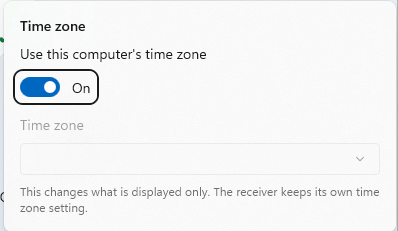

  Leave *Use this computer's time zone* on to see the receiver's time in your local zone, or turn
  it off and pick a zone. This changes what is **displayed** only — the receiver keeps its own
  time-zone setting.

### The footer

- **The status text** names the port and serial settings in use and how long ago the last reading
  arrived. It is grey while readings are fresh, turns **amber after 15 seconds** without one and
  **red after 60** — with the caution triangle or the critical hexagon beside the text — and
  always says the age in words, so a stale value is never mistaken for a current one.
- **Details** opens the Receiver Details window (`Ctrl+D`).
- **The pin** keeps this window above every other window. It stays pinned across restarts.
- **Connect / Disconnect** opens the connection dialog, or drops the connection (`Ctrl+Shift+C`).

### Compact mode

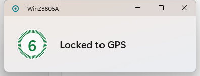

Compact mode is for a corner of the screen: the medallion shrinks, the satellite count moves into
its centre, and everything else goes. **The window itself shrinks to its compact size when you
enter compact mode, and comes back to the size it had when you leave.** Enter and leave it by
**double-clicking the medallion** or pressing **`Ctrl+Shift+M`**; **`Esc`** also leaves it. The
application remembers that you were in compact mode and reopens that way.

If you make the standard window very short without entering compact mode, the readouts, figures of
merit, clock line and footer are removed rather than squashed, and the satellite count moves into
the medallion's centre there too — the count is always on the screen somewhere.

---

## Connecting

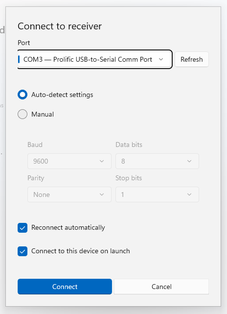

The first time the application runs it shows a **Connect your receiver** panel with one button,
**Choose a port**. Afterwards the dialog is reached from the main window's **Connect** button, from
`Ctrl+Shift+C`, or from the **status pill** in the Details window's title bar.

- **Port** lists the serial ports Windows can see; **Refresh** re-scans after plugging an adapter
  in. If no ports appear at all, the adapter's driver is the likely cause — check it in Device
  Manager.
- **Auto-detect settings** tries the likely baud rates and framings — listening first for a
  receiver that talks by itself, then asking for an identity — until one is recognised. Use it
  unless you know the settings. **Manual** exposes baud, data bits, parity and stop bits — the
  Z3805A's factory setting is 9600-8-N-1; a Z3801A leaves the factory at 19200-7-O-1, though
  some units in the field are set to even parity.
- **Reconnect automatically** keeps trying after the link drops — the adapter unplugged, the
  receiver power-cycled — with a growing pause between attempts.
- **Connect to this device on launch** does what it says; with it on, the application connects
  itself every time it starts.

Handshaking is always off. The application asserts DTR and RTS when it opens the port, which some
adapters need.

### Other receivers

The application also connects to any GPS receiver that speaks **NMEA 0183** — a u-blox module, a
marine receiver — through the same dialog: auto-detect hears it talking and chooses the NMEA driver
by itself. Such a receiver has no disciplined oscillator, so the application shows only what NMEA
carries: the mode (**Locked to GPS** with a fix, **Power-up** without one), the satellites being
tracked and the sky plot, the position, and the time and date. The 1 PPS TI, TFOM and FFOM, the
outputs, holdover, EFC, cable delay, status registers, self test, receiver log and error queue have
nothing behind them and show **—**, and the Advanced Console offers reads only; nothing is ever
sent to the receiver.

**Anything the receiver cannot do is greyed out with a line saying why** — *"This receiver does not
support an elevation mask. The NMEA 0183 driver has no command for it."* The controls are not
hidden: a page that quietly lost half of itself would look either broken or, worse, complete, and a
button that is visible and silently does nothing is the one thing that must not happen. So the
pages stay as they are, with dashes where a reading would be and a reason where a command would be.

---

## Receiver Details

Open it with the **Details** button or `Ctrl+D`. It is one window; opening it again brings the
existing one forward.

### The title bar

- **The status pill** says whether the receiver is connected and on which port. Clicking it opens
  the connection dialog.
- **Refresh full status** (`F5`) asks the receiver for its complete status now rather than waiting
  for the next scheduled read.
- **Export current view** (`Ctrl+E`) saves what the current page is showing as a file. It is
  disabled on pages that have nothing exportable.
- **Settings** (`Ctrl+,`) goes to the Settings page.
- **Help** (`F1`) opens this guide in its own window. `F1` does the same from the main window.

### The pages

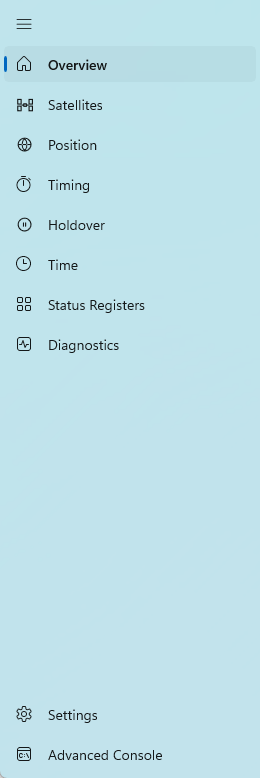

The eight pages in the main list are reachable with `Ctrl+1` to `Ctrl+8` in the order shown;
Settings and the Advanced Console sit in the footer and have no number. In a narrower window the
pane collapses to a rail of icons, and the button at its top opens it.

Every page's cards **flow into as many columns as the width allows** — one in a narrow window, two
or three when you widen it, each card going to whichever column is currently shortest. Widening the
window is therefore worth doing on the busier pages; nothing is hidden at any width.

#### Overview — `Ctrl+1`

Everything from the main window, with the words behind the numbers:

- **Synchronization** — the medallion and mode, whether the receiver's **outputs are valid**, TFOM
  and FFOM each with what the value means, and the 1 PPS TI relative to GPS.
- **Holdover uncertainty** — the receiver's own prediction of how far its time would drift in 24
  hours of holdover, the threshold that prediction is compared against, and how long it has been in
  holdover if it is. The threshold is **not** the point at which the receiver enters holdover;
  the Holdover page explains what it is and what the separate, settable duration limit does.
- **Health monitor** — one pill per subsystem the receiver checks (self test, internal power,
  oven power, the oscillator, its control voltage, the GPS receiver), and **Run test** to run the
  receiver's self-test now — it asks first, because the receiver stops doing other things while it
  tests itself. A failing subsystem turns its pill red; the summary line above says whether
  everything passes.
- **Oscillator control (EFC)** — the voltage the receiver is applying to steer its oscillator, as a
  percentage of its range, with a trend over the last **1 h**, **6 h**, **24 h** or **7 d**. A
  slowly drifting EFC is the oscillator ageing; a sudden change is worth a look.

#### Satellites — `Ctrl+2`

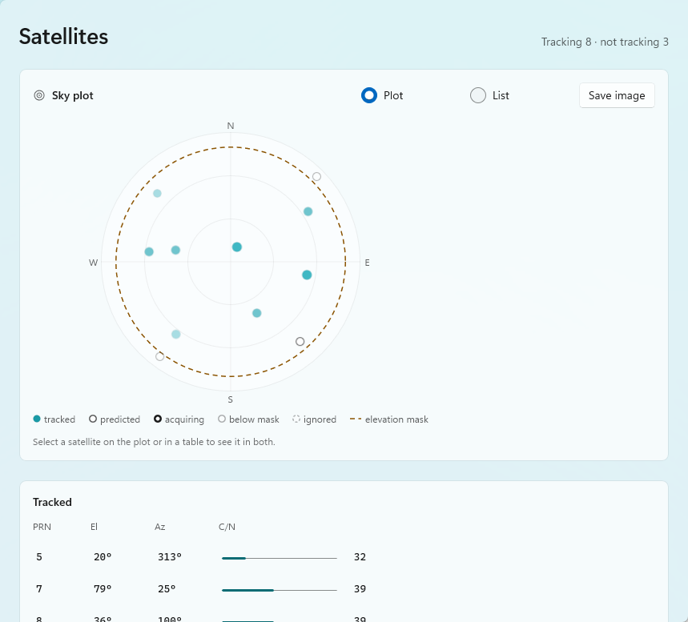

- **The sky plot** is the sky as the antenna sees it, north up, the horizon at the rim and straight
  up at the centre. Each dot is a satellite at its position; its fill shows signal strength, and a
  dashed circle marks the **elevation mask** — satellites below it are not used. Arrow keys move
  between satellites, `Home` and `End` jump to the first and last, and `Enter` or `Space` selects
  one, which highlights it in the table too. **List** swaps
  the plot for a plain table; **Save image** writes the plot to a file.

  

- **Tracked** and **Not tracked** tables list every satellite the receiver knows about with its PRN,
  elevation, azimuth and, for tracked ones, carrier-to-noise ratio — 35 and above is good.

  

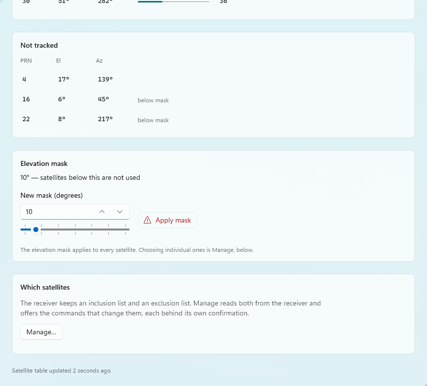

- **Elevation mask** — satellites below this elevation are ignored. The box **opens on the mask the
  receiver is using**, not on a default, so you can see what it is set to before changing it. Type a
  new angle or drag the **slider** beneath — they are two ways to move one value, not two values —
  and press **Apply mask**. It asks for confirmation first, because a mask that is too high can
  leave the receiver with too few satellites. Once you have typed, the number is yours: the
  once-a-second sweep will not overwrite it mid-edit.
- **Which satellites** — **Manage…** opens a dialog that reads the receiver's inclusion and
  exclusion lists and offers the commands that change them: track only the selected satellites,
  track all, clear exclusions, track none, exclude all. Each is confirmed before it is sent and
  nothing is staged, so closing the dialog sends nothing. Tracking none, or excluding them all,
  drives the receiver into holdover — the dialog says so.

#### Position — `Ctrl+3`

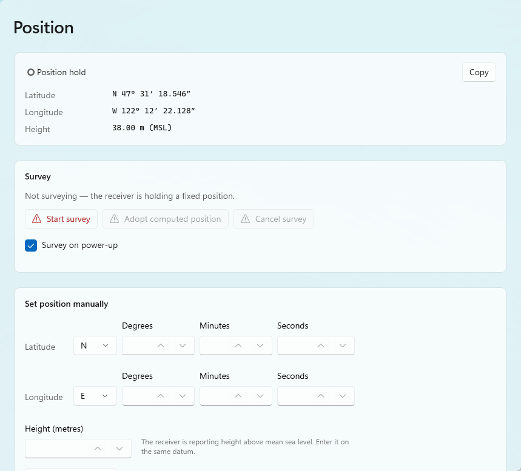

- **Latitude, longitude, height** — the antenna position the receiver is using for its timing
  solution. **Copy** puts it on the clipboard.
- **Survey** — a timing receiver needs to know exactly where its antenna is, and it can work that
  out by averaging fixes for about two hours. **Start survey** begins that; **Adopt computed
  position** stops early and takes the average so far; **Cancel survey** goes back to the last held
  position; **Survey on power-up** makes the receiver survey every time it is switched on. All of
  these are confirmed before they are sent.

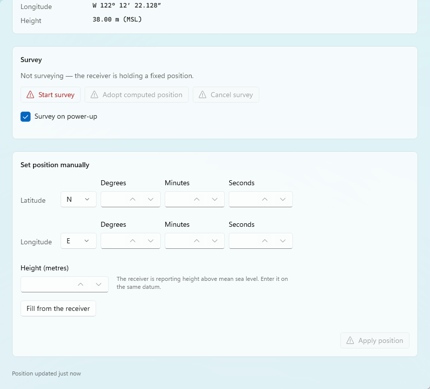

- **Set position manually** — if you know the antenna position better than a survey would, enter it
  here. **Fill from the receiver** copies the current position into the boxes to edit; **Apply
  position** sends it, after confirmation, and cancels any survey in progress. A wrong position
  degrades timing, which is why the confirmation says so.

#### Timing & antenna — `Ctrl+4`

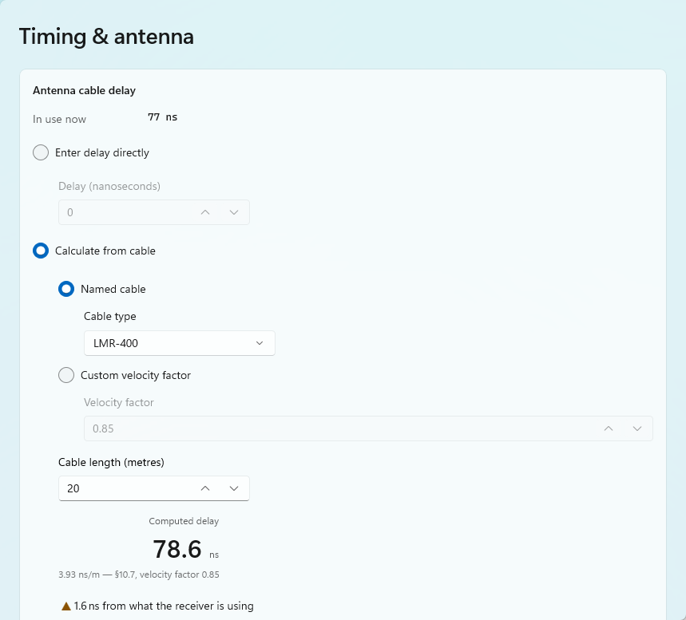

- **Antenna cable delay** — the receiver corrects its 1 PPS for the time the signal spends in the
  antenna cable, and it needs to be told how long that is. Either **enter the delay directly** in
  nanoseconds, or **calculate it from the cable**: pick a **named cable** type, or give a **custom
  velocity factor**, and the **cable length** in metres. **Apply delay** is confirmed first — the
  receiver may drop into holdover for a moment while it re-establishes lock at the new delay, and
  the *Before applying* note says so.

- **1 PPS time interval** and **Oscillator control (EFC)** — the same two quantities the main
  window and the Overview show, as trends over the range you choose.
- **Oscillator drift** — how the EFC is trending, which is the oscillator's ageing rate.
- **Stability (Allan deviation)** — the standard measure of an oscillator's short-term stability,
  computed from the recorded 1 PPS readings for a range of averaging times τ. The **differences
  averaged** column matters: a σy(τ) computed from a handful of differences is a rough number, and
  one from thousands is a firm one.

#### Holdover — `Ctrl+5`

Holdover is what the receiver does when it loses GPS: it keeps its oscillator running on the
corrections it had learned, and its time error grows from there.

- **Predicted 24 h uncertainty**, **present time error**, **duration** and — while it is *waiting to
  recover* — the **waiting reason** the receiver gives.
- **Thresholds** — there are two here, they measure different things, and **only the second can be
  changed**. The page says so beside each; this is the short version.

  - **Uncertainty threshold** is what the *predicted 24 h uncertainty* above is compared against.
    *Currently exceeded* means that if the receiver lost GPS now and ran on its own oscillator for a
    day, its time error would be expected to pass this figure. It is a **prediction about the
    oscillator, not a fault** — a receiver that has not been locked for long has not yet learned
    enough to promise better — and it is **read only**: the receiver's command set has exactly one
    settable threshold and this is not it.
  - **Holdover duration limit** is that one. It is how long the receiver may stay in holdover before
    it *raises a flag* — and nothing else: it does not end holdover, and it changes no output. The
    receiver simply starts reporting that holdover has run longer than you allowed, in the
    Questionable status register, which is what the state above reads. Enter a new value in seconds
    and **Apply duration limit**, after confirmation. The factory value is 86 400 seconds, one day;
    the setting is stored in the receiver and survives a power cycle.

  The two are easy to confuse, and the confusion has a symptom worth naming: change the duration
  limit and the uncertainty reading above it will never move, because they are not the same
  quantity.

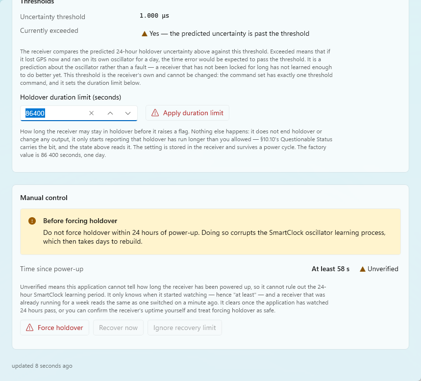

- **Manual control** — **Force holdover** puts the receiver into holdover deliberately, for testing
  or before pulling the antenna; **Recover now** asks it to leave holdover; **Ignore recovery limit**
  overrides the check that keeps it waiting. Each is confirmed, and the *Before forcing holdover*
  note is worth reading once: a receiver that has not been powered up for long has not finished
  learning its oscillator, and forcing holdover then proves little.

  The **time since power-up** beside it carries a verdict, and one of its values needs explaining
  because it is the one you will usually see. **Unverified** does not mean anything is wrong: the
  application can only bound the power-up time *from below*, because it knows when **it** started
  watching and not when the **receiver** was switched on — which is why the figure reads *at least*.
  A receiver that has been running for a week looks exactly like one switched on a minute ago. It
  becomes a definite answer once the application has watched 24 hours pass, or you can confirm the
  uptime yourself and disregard it.

#### Time — `Ctrl+6`

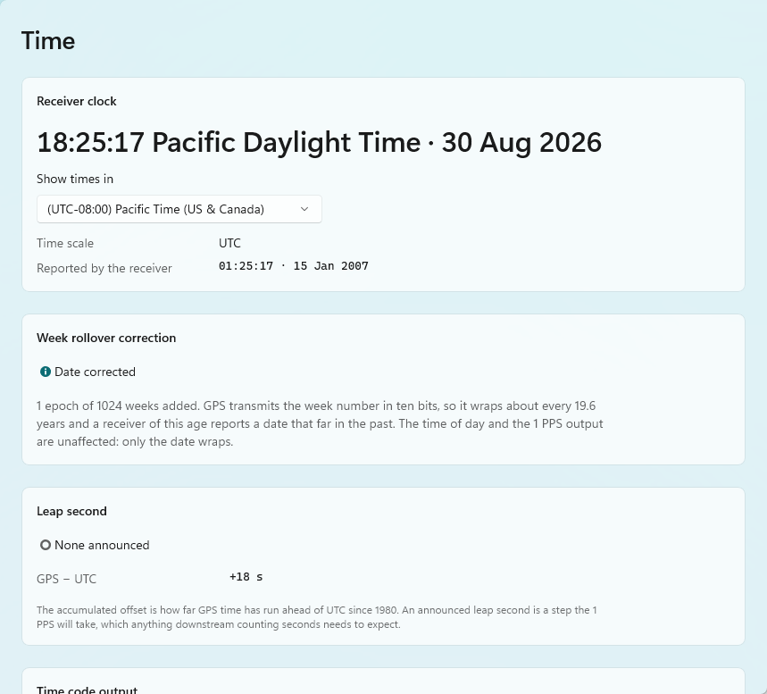

- **Receiver clock** — the receiver's time in the zone you pick with **Show times in**, the **time
  scale** it is keeping (UTC, GPS time, or local time derived from either), the date it
  **reported** as against the corrected one, the
  **week rollover correction** the application is applying, and when the receiver was **powered
  up**.

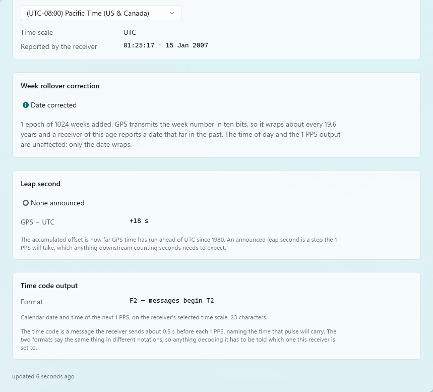

- **Leap second** — **GPS − UTC** is how far GPS time has run ahead of UTC since 1980 (whole seconds;
  GPS does not take leap seconds). **Announced for** shows a pending leap second, which is a step
  the 1 PPS will take and which anything downstream that counts seconds needs to expect.
- **Time code output** — the receiver sends a message about half a second before each 1 PPS naming
  the time that pulse will carry. The two **formats** say the same thing in different notations,
  so whatever decodes it has to be told which one the receiver is set to.

#### Status registers — `Ctrl+7`

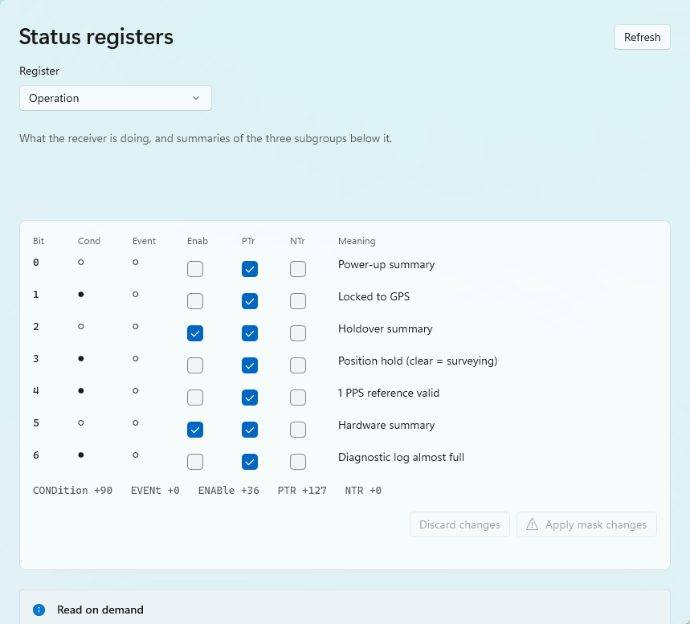

The receiver's SCPI status registers, bit by bit, with what each bit means. The **Cond**ition and
**Event** columns are what the receiver reports; **Enab**le and the positive and negative
**tr**ansition columns are the masks you can change. Registers are **read on demand** — use
**Refresh** — and mask edits are staged until **Apply mask changes** (confirmed) or **Discard
changes**. This page is for finding out why a summary bit is set; most people never need it.

#### Diagnostics — `Ctrl+8`

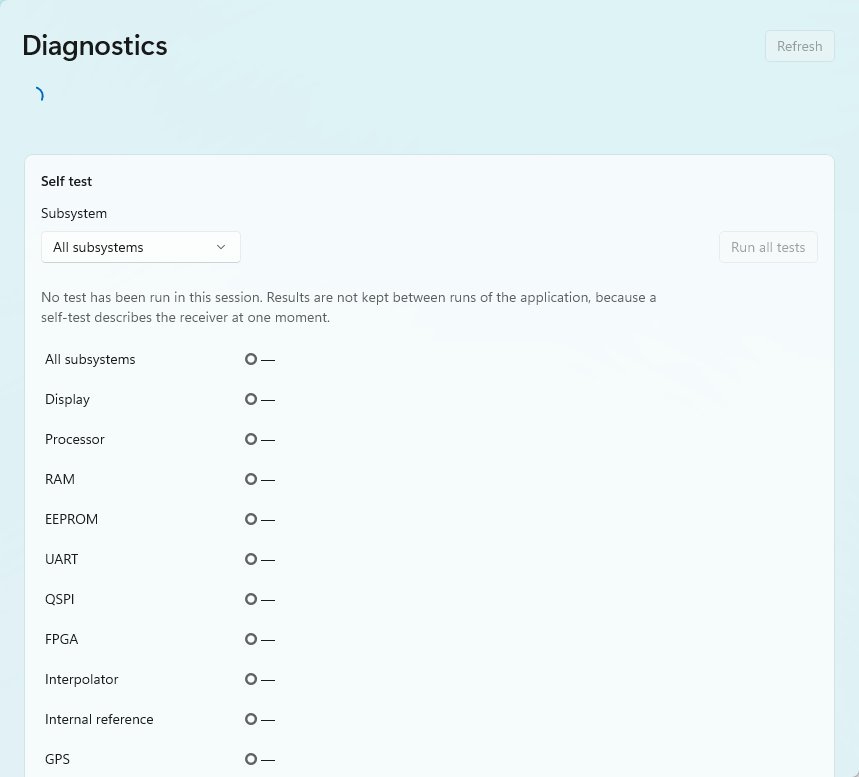

- **Self test** — pick one **subsystem** or all of them and press the button, which names what it
  is about to do (**Run all tests**, or **Test** followed by the subsystem) because the receiver
  drops what it is doing while it tests itself. Testing one subsystem fills in that subsystem's row;
  **Run all tests** returns a result for every subsystem and fills in all of them from the one
  sweep, against a shared timestamp. **Refresh** at the top of the page re-reads the last self-test
  result and the receiver's log.

  An `ALL` sweep is not free: on a Z3805A it takes about eleven seconds, and the receiver leaves
  GPS lock while it runs — expect a couple of minutes back to lock and a few more before the time
  figure of merit recovers. The confirmation says so before it runs.
- **The receiver's log** — the entries the receiver itself keeps, filterable, with **Export** to save
  what is shown (a filter applies to the file too) and **Clear log**, which removes the entries
  from the receiver after asking — export first if you want them. The list **scrolls inside its own
  card** rather than stretching the page, so a receiver with hundreds of entries does not bury
  everything below it. Timestamps are on the receiver's own time scale and are subject to the week
  rollover.

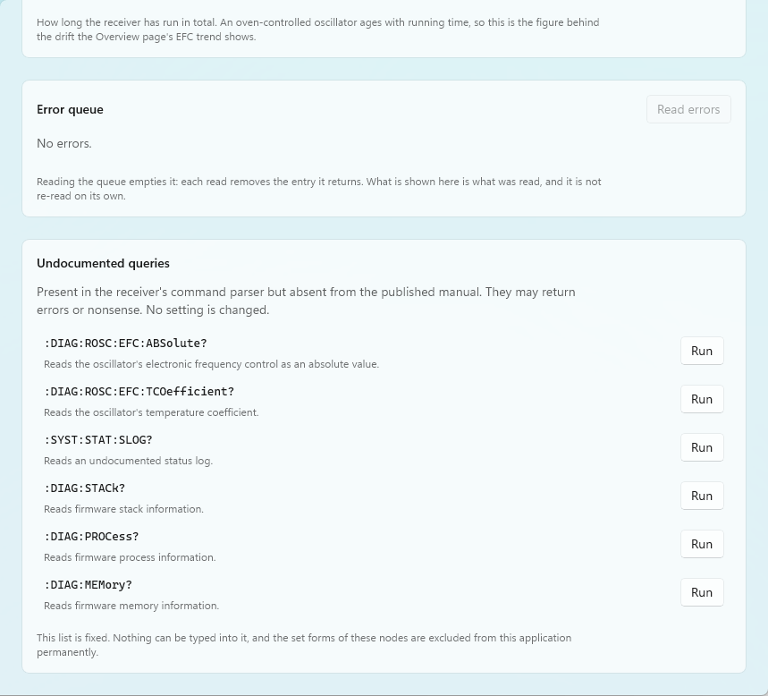

- **Application log** — what the application saw: the port opening, the settings auto-detect settled
  on, every connection change, and the receiver's mode and satellite count whenever they move.
  **Show log folder** opens it in Explorer. This is the place to look for a fault that comes and
  goes while nobody is watching the window.
- **Status screen parsing** — whether the last full status screen was understood completely. A
  field the application could not read becomes an em dash rather than a guess, and this card is
  where it says so, naming the line it could not parse. It is the first place to look if a reading
  is dashed when it should not be — usually a firmware revision printing something slightly
  different.
- **Lifetime** — **power-on hours**, how long the receiver has run in total. An oven-controlled
  oscillator ages with running time, so this is the figure behind the drift the Timing page reports.
- **Error queue** — **Read errors** reads the receiver's error queue. Reading it empties it: each
  read removes the entry it returns, so what is shown is what was read.
- **Undocumented queries** — present only when *Undocumented read-only queries* is on in Settings.
  Six read-only queries that exist in the receiver's firmware but not in its manual, each run only
  when you click **Run**. They may return errors or nonsense; none of them changes a setting, and
  nothing can be typed here.

#### Settings

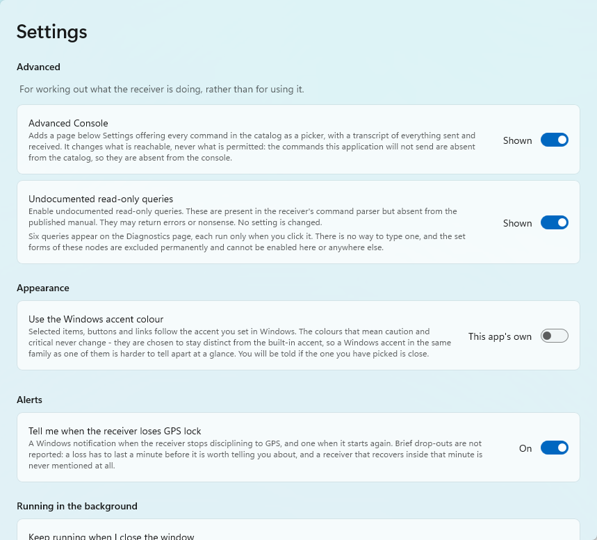

Every setting has its explanation next to it on the page; this is the short version.

| Setting | Off | On |
|---|---|---|
| 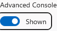 **Advanced Console** | The console page is not shown. | Adds the **Advanced Console** page below Settings — see below. It changes what is *reachable*, never what is *permitted*. |
|  **Undocumented read-only queries** | The Diagnostics page shows no undocumented queries. | The six read-only queries appear on the Diagnostics page. Nothing can be typed, and no setting can be changed through them. |
| 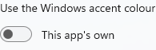 **Use the Windows accent colour** | Selected items, buttons and links use the application's own teal. | They follow the accent you chose in Windows. The colours that mean caution and critical never change, so if your Windows accent is close to one of them you will be told. |
| 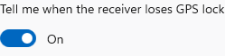 **Tell me when the receiver loses GPS lock** | No notifications. | A Windows notification when the receiver stops disciplining to GPS, and another when it starts again. A loss has to last a minute before it is reported, so a brief drop-out is never mentioned. |
| 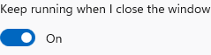 **Keep running when I close the window** | Closing the window exits, and monitoring stops with it. | Closing the window hides it and the receiver keeps being polled — see *When the window has gone*. This is the default. |
| 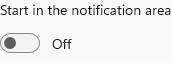 **Start in the notification area** | The window opens at launch. | The application starts with no window, monitoring from the notification area. |

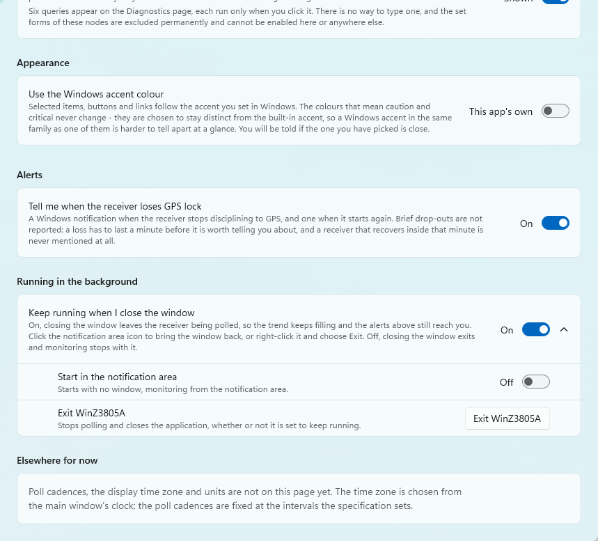

 **Exit** quits the application
outright — the exit that needs no notification-area icon. Poll cadences, the display time zone
and units are not on this page; the time zone is chosen from the main window's clock line, and the
poll cadences are fixed.

#### Advanced Console

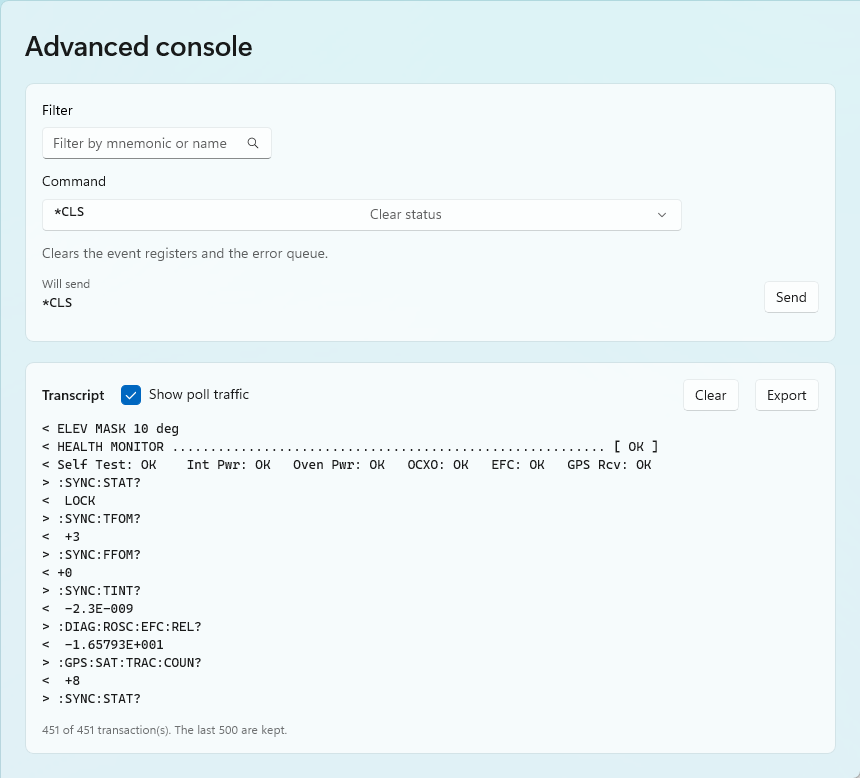

Shown when *Advanced Console* is on in Settings. It is a **picker, not a terminal**: choose a
command from the list (the **filter** narrows it by mnemonic or name), see exactly what **will be
sent**, and press **Send**. Commands that change something ask for confirmation with the
consequence spelled out, exactly as the pages do. The **transcript** shows everything sent and
received, the last 500 exchanges; **Show poll traffic** includes the application's own scheduled
reads, which arrive every second and would otherwise swamp what you sent; **Clear** empties the
transcript and **Export** saves it.

Nothing can be typed as a command, and the commands this application will not send — the ones that
can damage the receiver's calibration or firmware — are not in the list. They are not hidden
behind a warning; they are absent.

---

## When the window has gone

By default, **closing the main window does not exit the application**. It hides, the receiver
keeps being polled, the trend keeps filling, and lock notifications keep arriving. The first time
this happens a dialog says so — *Still running and still polling* — with **Keep running** and
**Exit now**, and it is not shown again.

What remains is an icon in the notification area — and **Windows 11 does not show a new icon on the
taskbar**. It goes into the hidden overflow behind the **`^`** chevron at the right of the taskbar
until you move it, and an application is not allowed to move it for you. So:

1. **Launch the application again.** It is single-instance: a second launch brings the existing
   window back rather than starting another copy. This needs no icon at all, and it is the route
   to reach for first.
2. **Or click the `^` chevron** (*Show hidden icons*) at the right of the taskbar; the icon is in
   that flyout. Click it to bring the window back, or right-click it for **Open** and **Exit**.
3. **To keep the icon visible**, drag it from the flyout onto the taskbar, or go to *Settings ›
   Personalization › Taskbar › Other system tray icons* and turn it on there.

To exit, right-click the icon and choose **Exit**, or use the **Exit** button on the Settings
page, which depends on nothing in the notification area. There is no confirmation: polling is not
a transaction and the trend is saved as it goes, so there is nothing to lose by stopping.

Two settings control all of this — *Keep running when I close the window* and *Start in the
notification area* — both on the Settings page.

**Lock notifications** are ordinary Windows notifications. If you have them on and none appear,
check *Settings › System › Notifications* for the application, and that Do Not Disturb is off; a
notification that was delivered while the banner was missed is still in the notification centre
(`Win+N`).

---

## Keyboard shortcuts

The main window and the Details window register different keys; the key works in the window that
has focus.

| Where | Key | Does |
|---|---|---|
| Main window | `Ctrl+D` | Open Receiver Details, or bring it forward |
| Main window | `Ctrl+Shift+C` | Connect, or disconnect if connected |
| Main window | `Ctrl+Shift+M` | Enter or leave compact mode (double-clicking the medallion does the same) |
| Main window | `Esc` | Leave compact mode |
| Details | `Ctrl+1` … `Ctrl+8` | Overview, Satellites, Position, Timing & antenna, Holdover, Time, Status registers, Diagnostics |
| Details | `F5` | Refresh full status now |
| Details | `Ctrl+E` | Export the current view |
| Details | `Ctrl+,` | Settings |
| Anywhere | `F1` | Open this guide |
| Anywhere | `Esc` | Cancel a dialog, close a flyout |
| Anywhere | `Tab`, `Shift+Tab`, arrows | Move between controls; on the sky plot, arrows move between satellites, `Home` and `End` jump to the ends, and `Enter` or `Space` selects |

In the Details window, every title-bar button's tooltip shows its shortcut. There is no `Ctrl+9`: Settings and the
Advanced Console live in the pane's footer and are reached with `Ctrl+,` and by clicking.

---

## Where things are kept

The application stores everything under its own folder in your profile —
`%LOCALAPPDATA%\Packages\<package family name>\LocalCache\Local\WinZ3805A\`, where the family
name is `WinZ3805A_` followed by a hash of the publisher — which is what *Show log folder* on the
Diagnostics page opens, so you never need to find it by hand. In it: the application log
(`logs\app.log`, rolled at 1 MB with four older files kept), the recorded trend (`trend.db`), the
remembered connection, and the window positions and settings. Uninstalling removes all of it; to
keep the trend across a reinstall,
uninstall from PowerShell with `Get-AppxPackage WinZ3805A | Remove-AppxPackage
-PreserveApplicationData`.

The application collects nothing and sends nothing anywhere. It has no network code at all;
everything it knows, it learned from the serial port.

**Further reading.** What each figure the receiver reports means is in the receiver's own user
and programming guides; how the application reads them, field by field, is §11 of the
specification in the repository.
